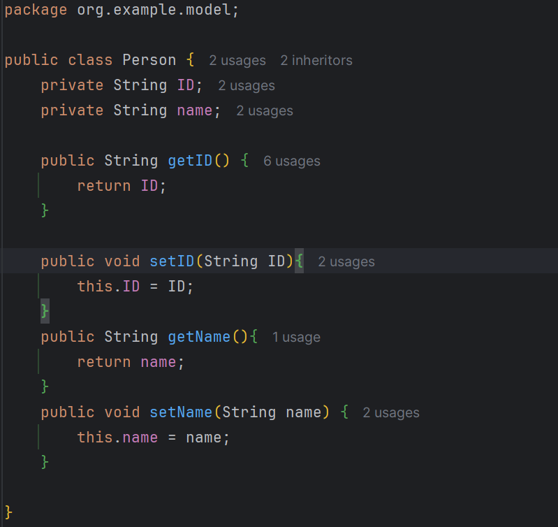
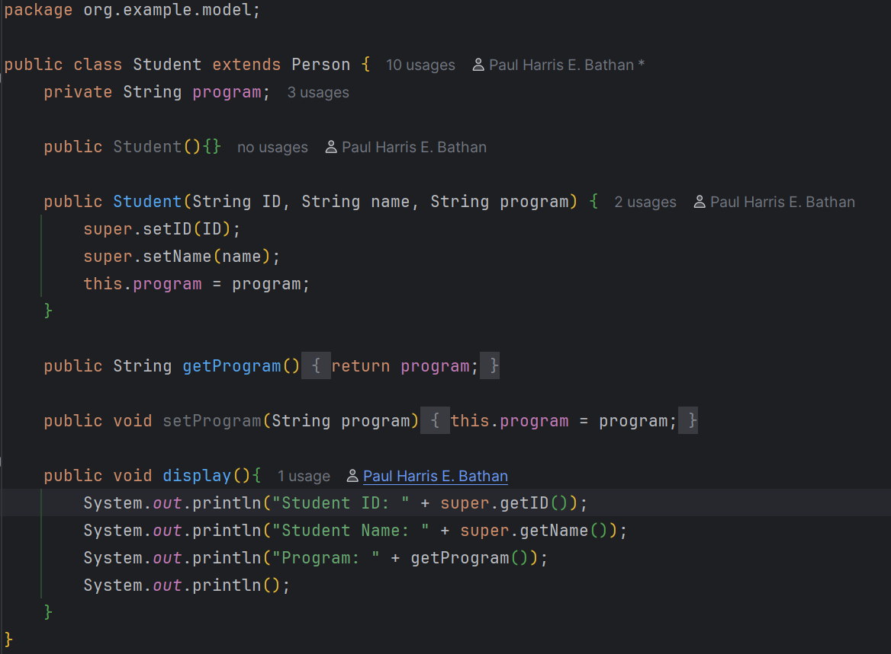
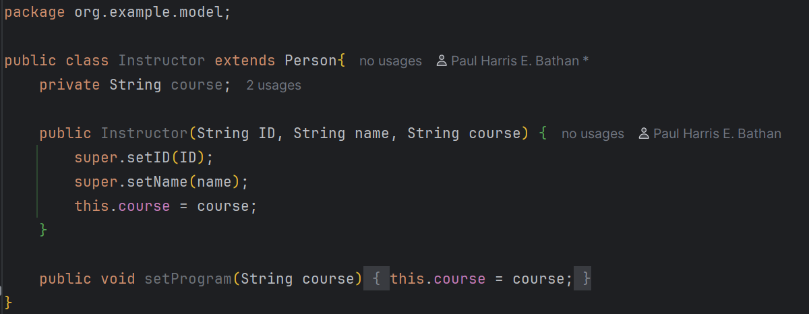
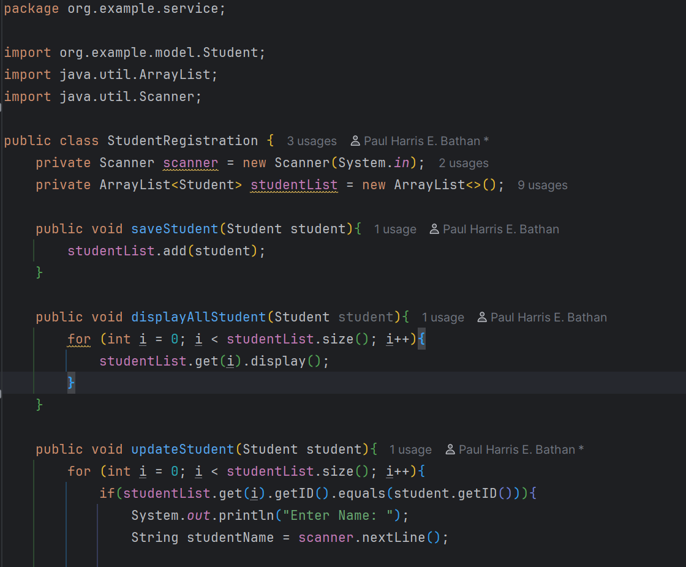
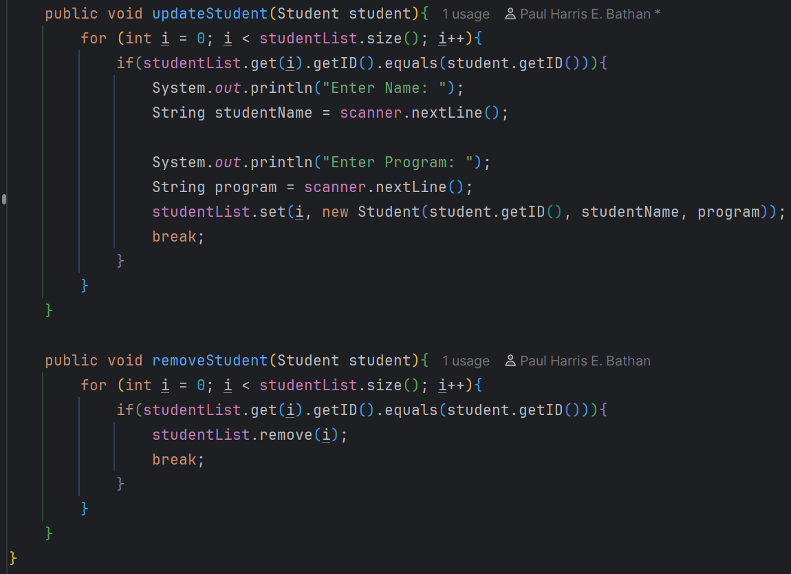
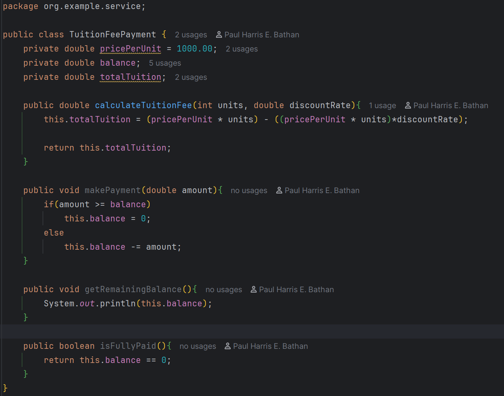
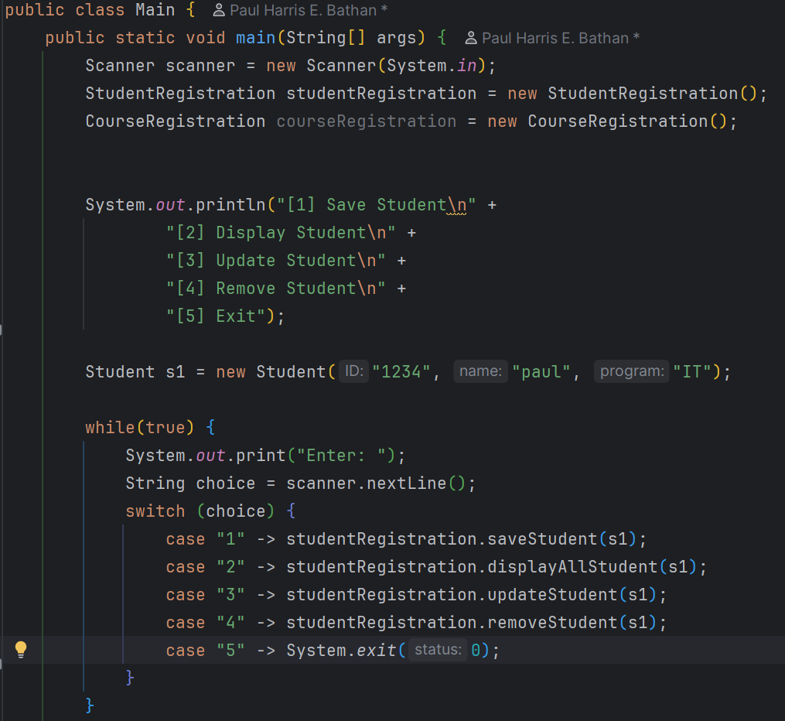
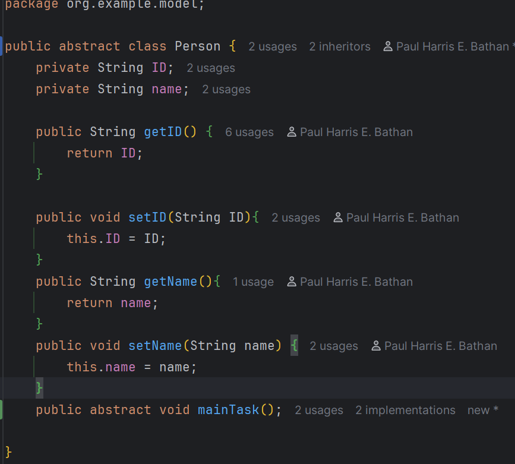
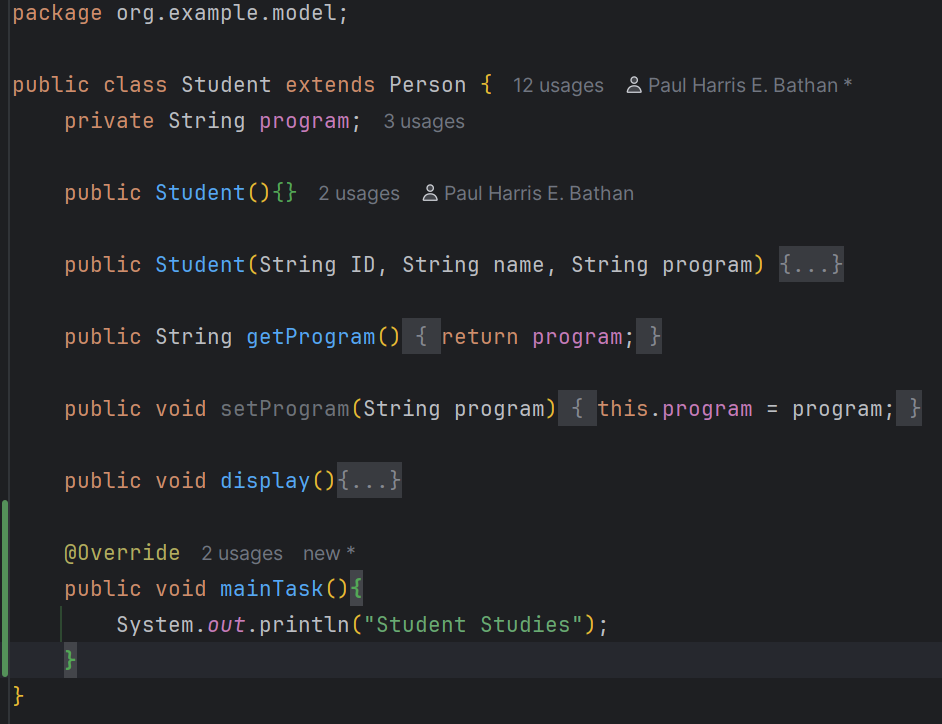
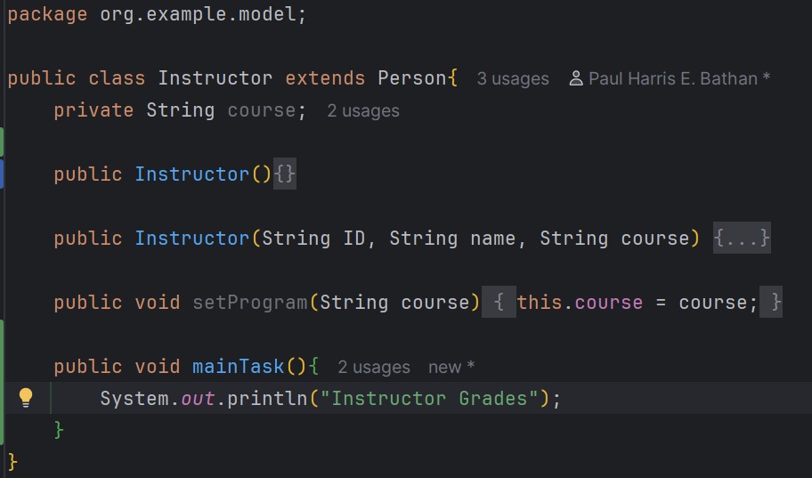

# OOP-Enrollment System

---

**Author:** Paul Harris E. Bathan

**1. Encapsulation Activity on Java February 7, 2026**  
**Description and Details**  

---

**2. Inheritance Activity on Java March 7, 2026**  
**Description and Details**  

Abstraction Class:

Concrete Class:  
Student

Instructor

*Note:*  
Refactored variable names in StudentRegistration Class:

Added in service folder TuitionFeePayment Class

Added in main switch case

---

**3. Abstraction Activity on Java March 14, 2026**  
**Description and Details**  

Applied Abstraction concepts to parent and child classes.

Person

Student

Instructor

